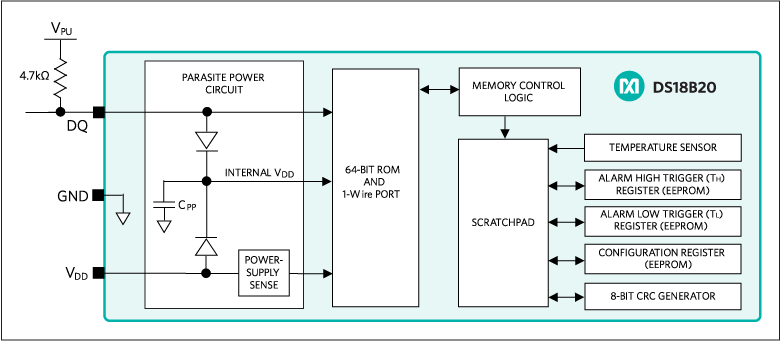
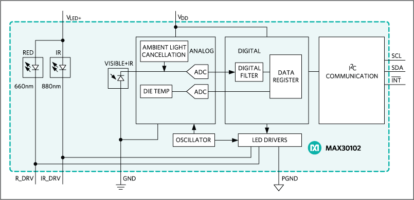
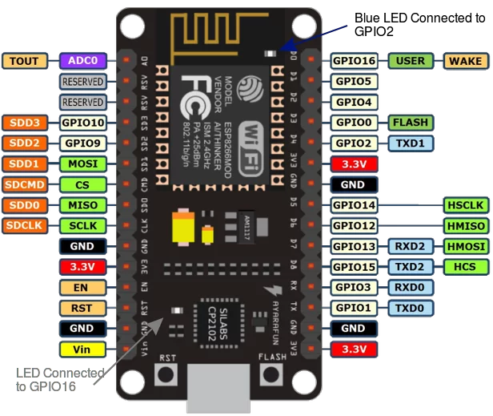

# Hardware

## Temperature Sensor
[DS18B20](https://www.analog.com/en/products/ds18b20.html): Programmable Resolution 1-Wire Digital Thermometer
- DS18B20 was chosen over LM35 as we need a digital sensor.
- I learned that this is a programmable sensor with an alarm range that can be set.
#### Circuit Digarm of DS18B20
  

#### Additional links
Purchase link: https://robu.in/product/ds18b20-temperature-sensor-module/
  
## Heart Rate and SpO2 Sensor
[MAX30102](https://www.analog.com/en/products/max30102.html): High-Sensitivity Pulse Oximeter and Heart-Rate Sensor for Wearable Health

- Low power consumption and suitable for health monitoring.
#### Circuit Digarm of MAX30102
  

#### Additional links
Purchase link: https://robu.in/product/max30102-heart-rate-and-pulse-oximeter-sensor-module-black/

## Microcontroller
[ESP8266](https://www.espressif.com/en/products/socs/esp8266): A low-cost Wi-Fi microcontroller

#### Pinout Diagram

#### Additional links
Purchase link: https://robu.in/product/nodemcu-cp2102-board/
