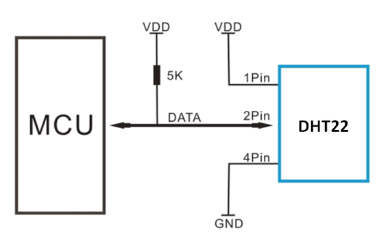

# Circuit Diagram

## Iteration 

Worked with [EasyEDA](https://easyeda.com/) to design and simulate.

# Hardware

## Temperature Sensor
[DS18B20](https://www.analog.com/en/products/ds18b20.html): Programmable Resolution 1-Wire Digital Thermometer
- DS18B20 was chosen over LM35 as we need a digital sensor.
- I learned that this is a programmable sensor with an alarm range that can be set.
  
#### Circuit Digarm of DS18B20
  

#### Additional links
Purchase links: 
- https://robu.in/product/ds18b20-temperature-sensor-module/
- https://www.amazon.in/dp/B073Q3D7YQ?psc=1&ref_=cm_sw_r_cp_ud_ct_8YESRAX66FTZGYBKTB3B_1
  
## Heart Rate and SpO2 Sensor
[MAX30102](https://www.analog.com/en/products/max30102.html): High-Sensitivity Pulse Oximeter and Heart-Rate Sensor for Wearable Health

- Low power consumption and suitable for health monitoring.
#### Circuit Digarm of MAX30102
  

#### Additional links
Purchase links: 
- https://robu.in/product/max30102-heart-rate-and-pulse-oximeter-sensor-module-black/
- https://www.amazon.in/dp/B097PLZT4D?psc=1&ref_=cm_sw_r_cp_ud_ct_8YESRAX66FTZGYBKTB3B_2

## Environment Sensor
[DHT22](https://robu.in/product/dht22-digital-temperature-humidity-sensor-temperature-humidity-module-am2302/): Capacitive-type humidity and temperature module/sensor
- It can be interchangeably used with DHT11

#### Circuit Diagram of DHT22

#### Additional links
Purchase links:
- https://robu.in/product/dht22-digital-temperature-humidity-sensor-temperature-humidity-module-am2302/
- https://www.amazon.in/dp/B07B8SSM33?psc=1&ref_=cm_sw_r_cp_ud_ct_8YESRAX66FTZGYBKTB3B_3

## Microcontroller
[ESP8266](https://www.espressif.com/en/products/socs/esp8266): A low-cost Wi-Fi microcontroller

#### Pinout Diagram

#### Additional links
Purchase links: 
- https://robu.in/product/nodemcu-cp2102-board/
- https://www.amazon.in/dp/B0829Z1W6Y?psc=1&ref_=cm_sw_r_cp_ud_ct_8YESRAX66FTZGYBKTB3B

## Breadboard and Jumpwires
To assemble the whole circuit

Purchase links:
- https://www.amazon.in/gp/product/B07PQS67BN/ref=ox_sc_act_title_1?smid=AJ6SIZC8YQDZX&th=1
